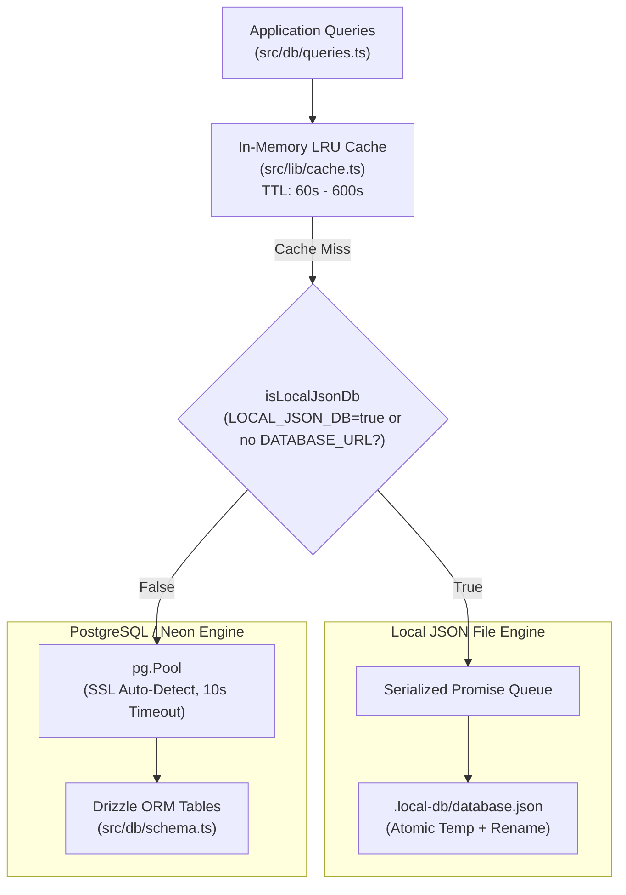

# Database Architecture & Optimization Guide

M & A features a **dual-engine resilient database architecture**: a high-speed local file-backed JSON database for zero-config local/containerized deployments, and production **PostgreSQL via Drizzle ORM** (optimized for **Neon Serverless Postgres**).

---

## 1. Dual-Engine Architecture



---

## 2. Neon Compute & Network Egress Optimizations

To reduce compute hours (CU-hrs), keep database sizes compact, and minimize cloud network transfer costs on Neon:

### A. In-Memory LRU Cache Layer (`src/lib/cache.ts`)
- High-frequency read queries are cached in memory to eliminate redundant database trips:
  - **`brand:settings`**: Cached for **10 minutes (600s)**.
  - **`dashboard:stats`**: Cached for **1 minute (60s)**.
  - **`properties:list`**: Cached for **2 minutes (120s)**.
- **Cache Invalidation**: Mutation operations (`setBrand`, property creation, campaign generation) immediately trigger targeted cache invalidation (`invalidateCache("brand")`, `invalidateCache("dashboard")`).

### B. Minimized Connection Duration
- `idleTimeoutMillis` set to **10,000 ms (10s)**: Allows Neon serverless computes to auto-suspend quickly into idle state (0 CU) when no requests are active.
- `connectionTimeoutMillis` set to **10,000 ms**: Prevents hanging requests from keeping compute pools awake during network degradation.

### C. Reduced Egress Transfer
- Large rendered images are stored as lightweight relative paths (`/images/props/...`) or proxied URLs rather than inlined multi-megabyte base64 strings in the database rows.
- Observability tracker ([`src/lib/observability.ts`](file:///src/lib/observability.ts)) monitors query frequency and estimated network egress bytes per endpoint.

---

## 3. Database Engines & Configuration

### Option 1: Local JSON Engine (Default for Local & Docker)
- **Active when**: `LOCAL_JSON_DB=true` or when `DATABASE_URL` is empty.
- **Storage Path**: `.local-db/database.json`.
- **Concurrency Safety**:
  - Thread-safe serialized Promise queue (`globalForLocalDatabase.__arenaLocalJsonDatabaseQueue`).
  - Atomic writes: data is written to a temporary UUID file first, then atomically renamed to replace `database.json`.
- **Docker Persistence**: In containerized environments, the directory is mounted to a named Docker volume (`creative-arena-data:/app/.local-db`).

### Option 2: PostgreSQL (Neon Serverless & Cloud Postgres)
- **Active when**: `DATABASE_URL` is set and `LOCAL_JSON_DB` is not set to `true`.
- **SSL Auto-Detection**: Automatically enforces SSL (`rejectUnauthorized: false`) for `*.neon.tech` hostnames.
- **Libpq Compatibility**: Appends `uselibpqcompat=true` when necessary to prevent connection drops across serverless edge boundaries.

---

## 4. Schema Definitions (`src/db/schema.ts`)

| Table Name | Description | Key Columns |
|---|---|---|
| `properties` | Property brief metadata | `id` (UUID PK), `name`, `location`, `propertyType`, `price`, `audience`, `amenities`, `description`, `source`, `createdAt` |
| `property_images` | Staged property imagery | `id` (UUID PK), `property_id` (FK cascade), `url`, `label`, `sortIndex` |
| `property_dna` | Analyzed Creative DNA | `id` (UUID PK), `property_id` (FK unique cascade), `dna` (JSONB) |
| `campaigns` | Campaign plan & direction | `id` (UUID PK), `property_id` (FK cascade), `preset`, `platforms` (JSONB), `options` (JSONB), `direction` (JSONB), `status` |
| `assets` | Generated ad creatives | `id` (UUID PK), `campaign_id` (FK cascade), `property_id` (FK cascade), `kind`, `aspect`, `payload` (JSONB), `score`, `checks` (JSONB), `approved` |
| `generations` | Activity & telemetry | `id` (UUID PK), `kind`, `model`, `duration`, `costCents`, `status`, `createdAt` |
| `settings` | App & brand configurations | `key` (Text PK), `value` (JSONB) — includes `brand`, `template_library`, and `campaign-model` settings |

---

## 5. Migration & Maintenance Commands

### Push Schema to PostgreSQL
Pushes any changes in `src/db/schema.ts` directly to your active PostgreSQL database:
```bash
npx drizzle-kit push
```

### Launch Drizzle Studio (Visual DB Explorer)
Opens an interactive web GUI to view, search, and edit database records:
```bash
npx drizzle-kit studio
```

### Generate SQL Migration Scripts
```bash
npx drizzle-kit generate
```

---

## 6. Auto-Seeding (`src/db/seed.ts`)

The database includes an idempotent auto-seed routine via `ensureSeed()`. If the `properties` table is completely empty on initial startup:
- Creates sample luxury properties (e.g., *Skyline Heights Residences*, *Green Valley Estates*).
- Analyzes and persists their Creative DNA.
- Populates initial campaign bundles and activity telemetry.
- Configures default brand settings.

Once data exists, `ensureSeed()` returns immediately with zero database writes.
