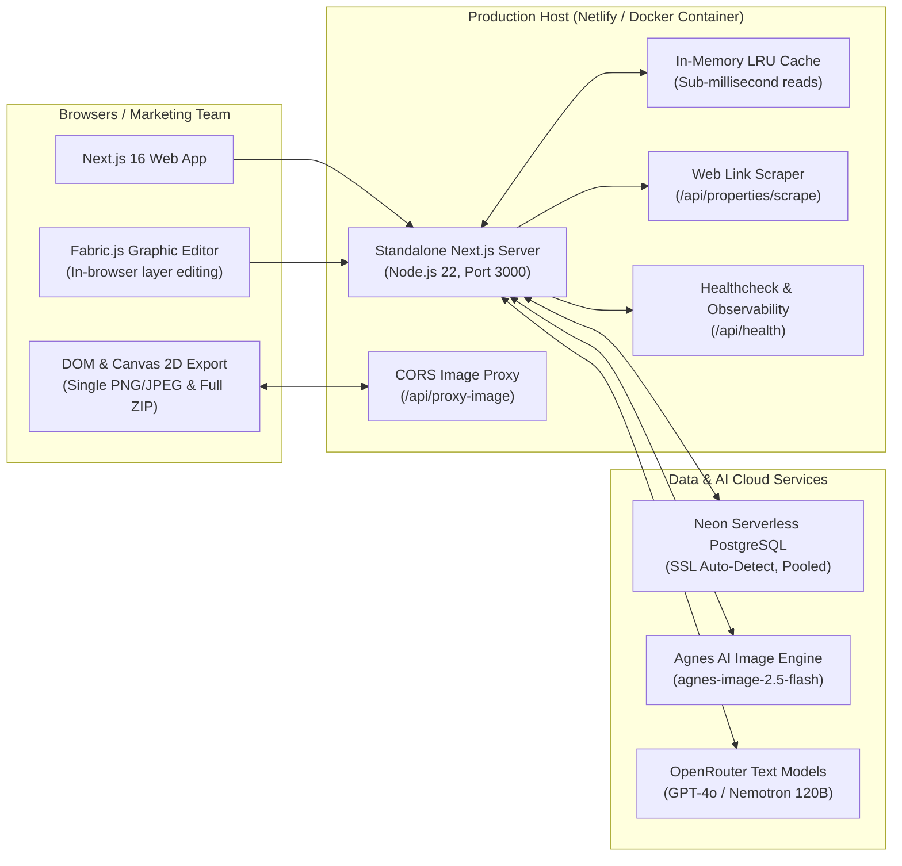

# Production Deployment & Operations Guide

This guide covers production deployment and operational maintenance for M & A Creative Arena across **Netlify** (live production host), **Docker Containerization**, and **Vercel / Cloud Platforms**.

---

## 1. Production Architecture Overview



---

## 2. Production Deployment Options

### Option A: Netlify (Live Production Host)
- **Live URL**: [https://creativearena.netlify.app/](https://creativearena.netlify.app/)
- **Runtime**: Next.js App Router via `@netlify/plugin-nextjs`
- **Build Configuration (`netlify.toml`)**:
  ```toml
  [build]
    command = "npm run build"
    publish = ".next"

  [[plugins]]
    package = "@netlify/plugin-nextjs"
  ```
- **Environment Variables**:
  - `DATABASE_URL`: Pooled connection string from Neon PostgreSQL.
  - `OPENROUTER_API_KEY`: API key for copy and prompt intelligence.
  - `AGNES_API_KEY`: API key for photorealistic architectural imagery.
  - `NETLIFY_SKIP_SECRET_SCAN=true`: Recommended to prevent false-positive secret blocking on build.

---

### Option B: Docker Container Deployment (Self-Hosted / Cloud VPS)
Ideal for AWS ECS, Google Cloud Run, Kubernetes, Railway, or standalone Linux VPS:

1. **Build Container**:
   ```bash
   docker build -t creative-arena:latest .
   ```

2. **Run with Docker Compose**:
   ```bash
   docker compose up -d --build
   ```

3. **Verify Health**:
   ```bash
   curl -s http://localhost:3000/api/health
   ```
   *Expected response:*
   ```json
   { "ok": true, "storage": "local-json", "metrics": { ... } }
   ```

---

### Option C: Vercel + Neon
1. Import GitHub repository into Vercel.
2. Configure `DATABASE_URL`, `OPENROUTER_API_KEY`, and `AGNES_API_KEY` in Project Settings.
3. Deploy directly with standard Next.js preset.

---

## 3. Pre-Flight Verification Checklist

Run these commands in CI/CD pipelines before any production deployment:

```bash
# 1. Clean install
npm ci

# 2. Typecheck (must pass with 0 errors)
npm run typecheck

# 3. Linting
npm run lint

# 4. Production standalone build
npm run build
```

---

## 4. Production Performance & Cost Optimizations

### 1. Neon Compute Unit (CU-hr) Minimization
- The built-in **in-memory LRU cache** ([`src/lib/cache.ts`](file:///src/lib/cache.ts)) caches `brand:settings` for 10 minutes and `dashboard:stats` for 1 minute.
- Reduced idle timeout (`idleTimeoutMillis: 10000`) allows Neon compute instances to quickly sleep (0 CU) when traffic ceases.

### 2. Network Transfer / Egress Minimization
- High-definition ad rendering and ZIP packaging execute **client-side** in the browser using HTML5 Canvas 2D and JSZip.
- The server never stores heavy raw PNG/JPEG export files on disk or in the database, reducing database storage to megabytes instead of gigabytes.

### 3. Server-Side Image Proxy
- The `/api/proxy-image` endpoint strips restrictive CORS headers from external property imagery, enabling high-definition HTML5 canvas rendering without tainting the browser canvas.

---

## 5. Security & Operational Guidelines

- **Authentication**: The studio currently operates without a user authentication layer. If exposing to public networks, protect ingress endpoints behind an authentication proxy (e.g. Cloudflare Access, OAuth, or NextAuth).
- **Environment Secrets**: Never commit `.env` or production API keys to git. Ensure `.dockerignore` excludes `.env`.
- **Health Monitoring**: Monitor `/api/health` with your uptime provider (e.g., BetterStack, UptimeRobot, or Datadog).
