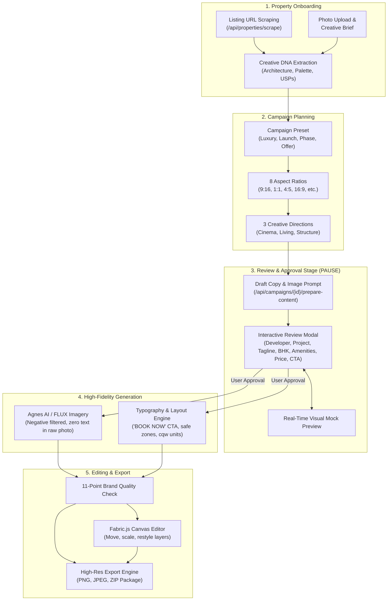

# M & A — AI Real Estate Creative Studio

> **AI-Powered Real Estate Creative Studio** — Transform property photos, listing URLs, and briefs into photorealistic, typography-composed, ready-to-publish property marketing campaigns with full user approval and in-browser design editing.
>
> 🌐 **Live Website**: [https://creativearena.netlify.app/](https://creativearena.netlify.app/)  
> 🐳 **Docker Hub / Production Image**: `creative-arena:latest` (~83 MB standalone)

M & A is brief-driven, not prompt-driven. Marketing teams onboard a property via **live web link scraping**, photo upload, or structured brief. The platform analyzes the property's **Creative DNA**, proposes **3 creative directions**, generates high-fidelity photorealistic architecture via **Agnes AI / FLUX**, halts for a **Content Review & Approval Stage**, allows in-browser graphic editing via **Fabric.js**, verifies compliance with an **11-point Brand Quality Check**, and exports a downloadable **high-resolution campaign package** across **8 distinct aspect ratios**.

---

## Table of Contents

- [Live Application](#live-application)
- [System Architecture](#system-architecture)
- [Key Features & Recent Upgrades](#key-features--recent-upgrades)
- [Multi-Platform Aspect Ratio Support](#multi-platform-aspect-ratio-support)
- [Tech Stack](#tech-stack)
- [Project Structure](#project-structure)
- [Prerequisites](#prerequisites)
- [Quick Start Guide](#quick-start-guide)
  - [Option A: Local Development (Fastest)](#option-a-local-development-fastest)
  - [Option B: Docker Compose (One-Command)](#option-b-docker-compose-one-command)
  - [Option C: Manual Docker CLI](#option-c-manual-docker-cli)
- [Environment Variables](#environment-variables)
- [Available Commands Reference](#available-commands-reference)
- [Database & Storage Modes](#database--storage-modes)
- [AI Models & Provider Setup](#ai-models--provider-setup)
- [Deployment Guides](#deployment-guides)
  - [1. Docker (Recommended Self-Hosted)](#1-docker-recommended-self-hosted)
  - [2. Netlify (Live Production Host)](#2-netlify-live-production-host)
  - [3. Vercel + Neon PostgreSQL](#3-vercel--neon-postgresql)
- [Troubleshooting & FAQ](#troubleshooting--faq)
- [Documentation Index](#documentation-index)

---

## Live Application

The production application is continuously deployed and live at:  
🔗 **[https://creativearena.netlify.app/](https://creativearena.netlify.app/)**

---

## System Architecture



---

## Key Features & Recent Upgrades

### 1. In-Browser Graphic Editor (`CreativeEditorModal` & Fabric.js v7)
- **Direct Canvas Editing**: Click **"Edit Creative"** on any visual asset to launch the full-featured Fabric.js vector canvas editor.
- **Layer Controls**: Drag, scale, re-order, restyle, change typography, adjust colors, and modify background images directly in the browser.
- **Non-Destructive Save**: Updates persist directly to the campaign asset payload without server re-generation.

### 2. Content Review & Approval Stage in the Generation Pipeline
- **Pipeline Halts for User Review**: Before rendering final creatives or executing AI image prompts, the pipeline generates a structured draft copy via [`/api/campaigns/{id}/prepare-content`](file:///src/app/api/campaigns/[id]/prepare-content/route.ts) and pauses for approval.
- **Editable Ad Typography**: Review and correct:
  - **Developer / Brand Name** (e.g. *Sobha Realty*)
  - **Project Name / Headline** (e.g. *Sobha Verde*)
  - **Tagline / Hook** (e.g. *Where Luxury Meets Nature*)
  - **Configuration / BHK Highlight** (e.g. *3 & 4 BHK*)
  - **Typology & Location Tag** (e.g. *Luxury Residences in Sector 102*)
  - **Key Amenities Line** (pipe-separated highlights)
  - **Starting Price Tag** (e.g. *₹ 1.85 Cr* Onwards*)
  - **CTA Button Text** (defaulting to `"BOOK NOW"`)
  - **AI Visual Prompt** (customized architectural prompt sent to Agnes AI / FLUX)
- **Live Interactive Mock Preview**: Live card updates in real time as fields are edited.
- **In-Workspace Modal**: Re-review and re-generate existing campaigns at any time via the workspace header.

### 3. Removal of Dummy Phone Numbers & Defaulting to "BOOK NOW"
- **Zero Dummy Numbers**: Eradicated all hardcoded `Call to : 1234567890` fallbacks across visual templates, DOM exporters, and canvas adapters.
- **Clean Action CTA**: All buttons and call bars default to **`"BOOK NOW"`** or user-approved custom action copy.

### 4. Removal of Aero Signs, Studio Watermarks & Series Names
- Eliminated aero signs (`↗`), `"ma-arena.studio"` text, and series label watermarks from all visual deliverables.
- Creatives are 100% clean, pristine, and ready for commercial posting.

### 5. Agnes AI & OpenRouter Integration for Architectural Imagery
- **Agnes AI Engine**: Integrates `agnes-image-2.5-flash` for ultra-fast, photorealistic luxury architectural photography.
- **Intelligent Prompt Engineering**: [`src/lib/creative/image-prompt-writer.ts`](file:///src/lib/creative/image-prompt-writer.ts) adds negative prompt constraints (zero overlaid text, clean skies, realistic textures, natural lighting).
- **Graceful Fallbacks**: Automatic fallback to OpenRouter FLUX.1 (`FLUX.1-schnell:free` / `FLUX.1-dev:free`) or Pollinations FLUX.
- **Text & Copy Models**: Support for OpenRouter flagship (`openai/gpt-4o`) and free models (`nvidia/nemotron-3-super-120b-a12b:free`, `openrouter/free`).

### 6. Database Storage & Network Egress Optimization
- **In-Memory LRU Caching**: Added high-efficiency cache layer ([`src/lib/cache.ts`](file:///src/lib/cache.ts)) for frequent database queries (`brand:settings`, `dashboard:stats`, `properties:list`), drastically reducing Neon compute hours (CU-hrs) and network transfer egress.
- **Observability Telemetry**: Tracks request counts, compute durations, and estimated egress in `/api/health` and `/api/admin/report`.

### 7. Production Docker Containerization (~83 MB Standalone)
- **Next.js Standalone Mode**: Enabled `output: "standalone"` in `next.config.ts`.
- **Multi-Stage Build**: Alpine Linux (`node:22-alpine`) with unprivileged non-root user (`nextjs:1001`).
- **One-Command Orchestration**: Includes `docker-compose.yml` with persistent volume support (`.local-db`).

---

## Multi-Platform Aspect Ratio Support

All aspect ratios are presented cleanly **by ratio only** (no platform or format names):

| Aspect Ratio | CSS Dimensions | Typical Output Resolution | Ideal Use Case |
|---|---|---|---|
| **9:16** | `9 / 16` | 1080 × 1920 px | Full-screen vertical stories, reels, shorts |
| **1:1** | `1 / 1` | 1080 × 1080 px | Square grid feeds (Instagram, Facebook, LinkedIn) |
| **4:5** | `4 / 5` | 1080 × 1350 px | Portrait feed ads with maximum screen real-estate |
| **16:9** | `16 / 9` | 1920 × 1080 px | Horizontal widescreen video, YouTube, website banners |
| **1.91:1** | `1.91 / 1` | 1200 × 628 px | Standard landscape link previews and display banners |
| **4:3** | `4 / 3` | 1440 × 1080 px | Classic display, tablet viewing, print cards |
| **3:4** | `3 / 4` | 1080 × 1440 px | Vertical tablet presentation and catalog listings |
| **2:3** | `2 / 3` | 1080 × 1620 px | High-fashion portrait format, Pinterest pins |

---

## Tech Stack

| Layer | Technology | Details |
|---|---|---|
| **Framework** | **Next.js 16.2.6** | App Router, React 19, Turbopack, Standalone Output |
| **Language** | **TypeScript 5.9** | Strict mode, full type-safety |
| **Graphic Editor** | **Fabric.js v7** | In-browser canvas manipulation, vector scaling, layer editing |
| **Database** | **PostgreSQL + Drizzle ORM** | `pg` driver + automatic Local JSON fallback (`.local-db`) |
| **Caching** | **In-Memory LRU Cache** | Sub-millisecond reads, Neon compute & egress optimizer |
| **Image AI** | **Agnes AI & FLUX** | `agnes-image-2.5-flash`, `FLUX.1-schnell:free` |
| **Text AI** | **OpenRouter** | `openai/gpt-4o`, `openai/gpt-4o-mini`, `openrouter/free` |
| **Web Scraper** | **Cheerio** | Server-side DOM parser for listing URLs |
| **Image Proxy** | **Server-side CORS Proxy** | `/api/proxy-image` prevents canvas tainting |
| **Export Engine** | **HTML5 Canvas 2D + JSZip** | Client-side 1080p DOM snapshot rendering & ZIP packaging |
| **Styling** | **Tailwind CSS v4** | Container query units (`cqw`), Fraunces, Inter, IBM Plex Mono |
| **Container** | **Docker & Docker Compose** | Multi-stage build, Alpine Node 22, ~83 MB content size |

---

## Project Structure

```
.
├── Dockerfile                        # Multi-stage production Docker build (~83 MB)
├── docker-compose.yml                # Docker Compose orchestration with volume persistence
├── .dockerignore                     # Build context exclusions (prevents secret leakage)
├── next.config.ts                    # Next.js config with standalone output enabled
├── package.json                      # Dependencies and npm scripts
├── drizzle.config.ts                 # Drizzle Kit schema and database configuration
├── .env.example                      # Complete environment variable template
├── public/                           # Static assets, fonts, icons, sample photography
├── src/
│   ├── app/
│   │   ├── page.tsx                  # Studio Overview (Dashboard & Activity)
│   │   ├── layout.tsx                # Fonts, theme providers, app shell
│   │   ├── globals.css               # Design system tokens, cqw typography rules
│   │   ├── properties/               # Property management & web scraping wizard
│   │   ├── campaigns/                # 3-stage campaign creator & workspace
│   │   │   ├── new/page.tsx          # Brief -> Direction -> Content Review & Approval
│   │   │   └── [id]/workspace.tsx    # Live workspace, export suite, in-workspace review modal
│   │   ├── assets/                   # Searchable & filterable asset library
│   │   ├── templates/                # Ad design presets & aspect ratio catalog
│   │   ├── brand/                    # Brand settings, color palette & 11-point QC kit
│   │   ├── admin/                    # Observability, compute telemetry & CSV report
│   │   └── api/                      # Full suite of RESTful API route handlers
│   │       ├── health/               # Database connectivity & egress telemetry
│   │       ├── properties/           # CRUD & DNA re-analysis
│   │       ├── properties/scrape/    # Listing URL web scraper
│   │       ├── proxy-image/          # Server-side CORS proxy
│   │       ├── campaigns/            # Campaign planning & generation
│   │       ├── campaigns/[id]/prepare-content/ # Content drafting for review stage
│   │       ├── image-models/         # Supported Agnes AI & FLUX image models
│   │       └── models/               # Supported OpenRouter text models
│   ├── components/                   # UI components, layout shell, cards, modals
│   │   ├── ad-creative.tsx           # Multi-aspect visual ad post rendering engine
│   │   ├── editor/                   # CreativeEditorModal with Fabric.js adapter
│   │   ├── campaigns/                # ReviewContentModal for approval workflow
│   │   └── pipeline.tsx              # Generation progress overlay
│   ├── db/
│   │   ├── schema.ts                 # Drizzle ORM table definitions
│   │   ├── queries.ts                # Data access layer with cache integration
│   │   ├── seed.ts                   # Idempotent demo auto-seeder
│   │   ├── local-json.ts             # Atomic JSON file database engine
│   │   └── index.ts                  # Dual-engine connection pool manager
│   └── lib/
│       ├── cache.ts                  # In-memory LRU cache (Neon compute saver)
│       ├── observability.ts          # Egress, CU-hr and latency tracking
│       └── creative/
│           ├── engine.ts             # Core creative intelligence, copy composer, QC rules
│           ├── presets.ts            # 8 aspect ratios, brand defaults, direction templates
│           ├── image-provider.ts     # Agnes AI & FLUX image generation client
│           ├── image-prompt-writer.ts# Architectural prompt engineering & negative filters
│           └── models.ts             # OpenRouter model resolver & fallback chains
├── README.md                         # Main project overview (this file)
├── README-API.md                     # Comprehensive HTTP API documentation
├── README-DB.md                      # Database architecture & optimization guide
├── README-DOCKER.md                  # Detailed Docker container deployment guide
├── README-PROD.md                    # Production hosting & operational checklist
└── CHANGELOG.md                      # Detailed release history
```

---

## Prerequisites

- **Node.js**: v20.x or v22.x LTS (tested up to v24.x)
- **Package Manager**: `npm` v10+
- **Docker**: (Optional) Docker Desktop v24+ with Compose v2+
- **Database**: PostgreSQL 14+ (or use the built-in local JSON database — no external DB needed!)

---

## Quick Start Guide

### Option A: Local Development (Fastest)

The application includes an embedded local JSON database engine (`.local-db/database.json`), allowing instant startup without provisioning PostgreSQL or Docker.

```bash
# 1. Install dependencies
npm install

# 2. Setup environment variables
cp .env.example .env

# 3. Start development server
npm run dev
```

Open **http://localhost:3000** in your browser. The initial request auto-seeds sample properties and campaigns.

> **Windows PowerShell Tip:** If npm script execution is restricted by PowerShell policies, run via `cmd.exe`:
> ```powershell
> cmd /c npm install
> cmd /c npm run dev
> ```

---

### Option B: Docker Compose (One-Command)

Run the fully isolated production container with persistent volume storage in one command:

```bash
# 1. Ensure .env is populated with any desired AI keys
cp .env.example .env

# 2. Build and start the container
docker compose up -d --build

# 3. View live logs
docker compose logs -f
```

Open **http://localhost:3000**. All created campaigns persist in the Docker volume `creative-arena-data`.

To stop the container:
```bash
docker compose down
```

---

### Option C: Manual Docker CLI

```bash
# 1. Build the lightweight production image (~83 MB)
docker build -t creative-arena:latest .

# 2. Run container with local JSON storage volume
docker run -d \
  --name creative-arena-app \
  -p 3000:3000 \
  --env-file .env \
  -v creative-arena-data:/app/.local-db \
  creative-arena:latest
```

---

## Environment Variables

| Variable | Required | Default | Purpose |
|---|---|---|---|
| `LOCAL_JSON_DB` | Optional | `true` | When `true`, uses the embedded atomic file database (`.local-db`). |
| `DATABASE_URL` | Optional | *None* | PostgreSQL URI (e.g. Neon connection string). When omitted, auto-falls back to JSON mode. |
| `OPENROUTER_API_KEY` | Optional | *None* | OpenRouter API key for automated copywriting and prompt intelligence. |
| `OPENROUTER_MODEL` | Optional | `openai/gpt-4o` | Model used for copywriting. Supports `openai/gpt-4o-mini`, `openrouter/free`, etc. |
| `AGNES_API_KEY` | Optional | *None* | Agnes AI API key for photorealistic architectural imagery generation. |
| `AGNES_BASE_URL` | Optional | `https://apihub.agnes-ai.com/v1` | Agnes AI API endpoint URL. |
| `AGNES_MODEL` | Optional | `agnes-image-2.5-flash` | Agnes AI model variant (`agnes-image-2.5-flash` or `2.1-flash`). |
| `IMAGE_API_BASE_URL` | Optional | *None* | Alternative image generation provider base URL (e.g., FLUX.1). |
| `IMAGE_API_KEY` | Optional | *None* | Key for alternative image provider. |
| `IMAGE_MODEL` | Optional | *None* | Model slug for alternative image provider. |

---

## Available Commands Reference

| Command | Purpose |
|---|---|
| `npm run dev` | Starts local Next.js development server with Turbopack on port 3000. |
| `npm run build` | Compiles optimized production build with standalone output (`.next/standalone`). |
| `npm run start` | Runs the compiled production build locally. |
| `npm run typecheck` | Runs TypeScript compiler verification (`tsc --noEmit`) with 0 errors. |
| `npm run lint` | Runs ESLint analysis across all project files. |
| `npx drizzle-kit push` | Applies TypeScript schema updates directly to the PostgreSQL database. |
| `npx drizzle-kit studio` | Launches Drizzle Studio GUI for inspecting and editing database records. |
| `docker build -t creative-arena .` | Builds the multi-stage production Docker container image. |
| `docker compose up -d` | Launches containerized application with volume persistence in detached mode. |
| `docker compose logs -f` | Tails streaming logs from the running Docker application container. |

---

## Database & Storage Modes

1. **Local JSON Database Mode (`LOCAL_JSON_DB=true`)**:
   - Stores data atomically in `.local-db/database.json`.
   - Zero installation, zero cloud latency, instant cold-starts.
   - Ideal for local development, previews, and self-hosted single-node Docker containers.

2. **Managed PostgreSQL Mode (e.g., Neon Serverless)**:
   - Configured simply by supplying `DATABASE_URL=postgresql://...`.
   - Built-in connection pooling (`pg.Pool`), SSL auto-detection for `neon.tech`, and idle timeouts.
   - Protected by an **in-memory LRU cache** ([`src/lib/cache.ts`](file:///src/lib/cache.ts)) to minimize compute unit consumption (CU-hrs) and network egress.

---

## AI Models & Provider Setup

### Text & Copywriting (OpenRouter)
- **Flagship Recommended**: `openai/gpt-4o` (SOTA real estate copywriting, tone adaptation, and prompt engineering).
- **Fast & Cost-Effective**: `openai/gpt-4o-mini`.
- **Top Free 120B Model**: `nvidia/nemotron-3-super-120b-a12b:free`.
- **Universal Free Router**: `openrouter/free` (Automatic failover among all available free providers).

### Image Generation (Agnes AI & FLUX)
- **Agnes AI (`agnes-image-2.5-flash`)**: Specializes in photorealistic architecture, realistic perspective, interior lighting, and structural materials.
- **FLUX.1 (`black-forest-labs/FLUX.1-schnell:free`)**: High-performance open-weights photorealism.
- **Strict Negative Prompting**: Ensured by [`src/lib/creative/image-prompt-writer.ts`](file:///src/lib/creative/image-prompt-writer.ts) to guarantee raw imagery is generated completely free of distorted text overlays, watermarks, or clutter.

---

## Deployment Guides

### 1. Docker (Recommended Self-Hosted)
Refer to [README-DOCKER.md](README-DOCKER.md) for full instructions on deploying via Docker CLI, Docker Compose, AWS ECS, or Kubernetes.

### 2. Netlify (Live Production Host)
Configured via `netlify.toml` and `@netlify/plugin-nextjs`.
1. Push code to GitHub repository.
2. Link project in Netlify dashboard.
3. Add environment variables: `DATABASE_URL`, `OPENROUTER_API_KEY`, `AGNES_API_KEY`.
4. Deploy.

### 3. Vercel + Neon PostgreSQL
1. Import repository into Vercel.
2. Add `DATABASE_URL` pointing to your Neon database branch.
3. Push schema: `npx drizzle-kit push`.
4. Deploy.

---

## Troubleshooting & FAQ

| Issue | Root Cause | Solution |
|---|---|---|
| Port 3000 in use | Another process is bound to port 3000 | In Docker, map to an alternate port: `-p 3001:3000`. |
| PowerShell script execution blocked | Execution policy restricts `.ps1` scripts | Run commands prefixing `cmd /c` (e.g. `cmd /c npm run dev`). |
| Canvas export images blank | Cross-origin image tainting canvas | Handled automatically via `/api/proxy-image` server-side CORS proxy. |
| Neon SSL connection errors | SSL mode required by cloud Postgres | `src/db/index.ts` automatically attaches `rejectUnauthorized: false` for `neon.tech`. |
| Changes in local DB not persisting in Docker | Volume not mapped | Run with `-v creative-arena-data:/app/.local-db` or use `docker compose up`. |

---

## Documentation Index

- 📘 **[HTTP API Reference](README-API.md)** — Detailed endpoint specification, request/response payloads, and review route details.
- 🗄️ **[Database Architecture Guide](README-DB.md)** — Dual-engine architecture, schema relationships, LRU caching, and Neon optimization.
- 🐳 **[Docker Deployment Guide](README-DOCKER.md)** — Multi-stage Docker build, standalone optimization, security, and compose setups.
- 🚀 **[Production Operations Guide](README-PROD.md)** — Production checklist, security recommendations, and monitoring.
- 📜 **[Changelog](CHANGELOG.md)** — Chronological log of all versions, enhancements, and bug fixes.

---

**M & A — AI Real Estate Creative Studio**  
🌐 Live at: [https://creativearena.netlify.app/](https://creativearena.netlify.app/)
